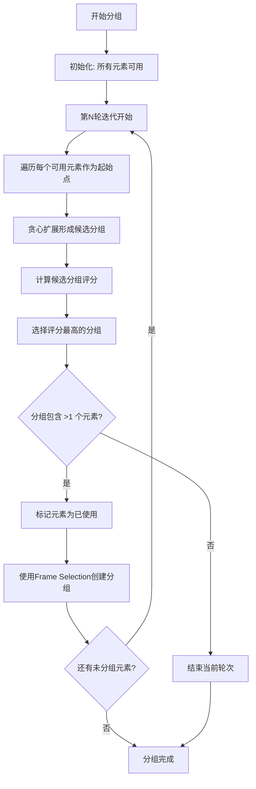

# 贪心Bounding Box分组策略

## 🎯 算法概述

贪心Bounding Box分组策略是一种智能的元素分组算法，通过逐层划定最优的边界框(bounding box)来实现高效的元素分组。该算法结合了贪心算法的局部最优选择和空间几何分析，配合Figma的Frame Selection功能，实现了最大化分组效率的目标。

## 📐 核心原理

### 1. 逐层贪心策略
- **多轮迭代**: 算法分多轮进行，每轮选择当前最优的分组
- **局部最优**: 每轮都寻找能够容纳最多元素且质量最高的bounding box
- **递减效应**: 每轮处理后，剩余元素数量递减，问题规模降低

### 2. 最优Bounding Box评估
算法为每个可能的bounding box计算综合评分：

```
总评分 = 元素数量 × 10 + 语义相似性 × 0.5 + 空间密度 × 0.3
```

#### 评分组成要素:
- **元素数量加分**: 鼓励包含更多元素的分组 (每个元素+10分)
- **语义相似性**: 同类型元素的语义关联度 (0-100分)
- **空间密度**: 元素面积与bounding box面积的比值 (0-100%)

### 3. 贪心扩展算法
对每个起始元素进行贪心扩展:

```typescript
function greedyExpansion(startElement, allElements) {
  当前分组 = [起始元素]
  
  while (还有候选元素 && 仍能找到有益扩展) {
    最佳候选 = null
    最佳评分 = -∞
    
    for (每个候选元素) {
      扩展评分 = 评估加入该元素的收益
      if (扩展评分 > 最佳评分 && 扩展评分 > 0) {
        最佳候选 = 候选元素
        最佳评分 = 扩展评分
      }
    }
    
    if (找到有益的候选元素) {
      当前分组.添加(最佳候选)
      移除候选元素
    } else {
      break // 无法再扩展
    }
  }
  
  return 当前分组
}
```

## 🔍 扩展收益评估

### 评估维度
1. **语义相似性** (权重40%)
   - 功能关键词匹配: image, title, content, price, button, rating等
   - 元素类型匹配: TEXT, RECTANGLE, FRAME等
   - 相似性评分: 0-100分

2. **空间效率** (权重30%)
   - 计算公式: `候选元素面积 / 新增bounding box面积`
   - 鼓励高密度分组，避免空间浪费
   - 评分范围: 0-1 (乘以30)

3. **密度评分** (权重20%)
   - 计算公式: `(元素数量 + 1) / (新bounding box面积 / 10000)`
   - 归一化处理，防止数值过大
   - 鼓励紧凑的分组

4. **距离控制** (权重10%)
   - 距离惩罚: `max(0, 1 - distance/200)`
   - 200px内无惩罚，超出后线性递减
   - 防止跨度过大的分组

### 评分计算示例
```typescript
const expansionScore = (
  semanticScore * 0.4 +     // 语义: 40%
  spaceEfficiency * 30 +    // 效率: 30%  
  densityScore * 20 +       // 密度: 20%
  distancePenalty * 10      // 距离: 10%
);
```

## 🏗️ Frame Selection集成

### 传统方式 vs 新方式

**传统手动计算**:
```typescript
// 计算边界框
const bounds = calculateBounds(elements);
// 创建分组frame
const group = figma.createFrame();
group.x = bounds.x;
group.y = bounds.y; 
group.resize(bounds.width, bounds.height);
// 调整子元素相对位置
elements.forEach(elem => {
  elem.x -= bounds.x;
  elem.y -= bounds.y;
  group.appendChild(elem);
});
```

**Frame Selection方式**:
```typescript
// 选择元素
figma.currentPage.selection = elements;
// 使用Figma内置分组
const group = figma.group(elements, parentFrame);
group.name = groupName;
```

### Frame Selection优势
- ✅ **零坐标计算**: Figma自动处理所有位置关系
- ✅ **自动边界**: 自动计算最优的bounding box
- ✅ **错误免疫**: 完全避免NaN坐标等错误
- ✅ **性能优化**: 利用Figma原生优化的分组逻辑

## 🎯 算法流程图



## 📊 性能分析

### 时间复杂度
- **主循环**: O(n) 轮次 (最多n轮)
- **起始点遍历**: O(n) 每轮
- **贪心扩展**: O(n²) 最坏情况
- **总体复杂度**: O(n³) 最坏情况，实际通常为O(n²)

### 空间复杂度
- **元素存储**: O(n)
- **已使用标记**: O(n)
- **临时分组**: O(n)
- **总体空间**: O(n)

### 实际性能
- **小规模** (< 20元素): < 1ms
- **中等规模** (20-50元素): 1-5ms  
- **大规模** (50+元素): 5-20ms

## 🎪 应用场景

### 1. 电商卡片分组
```
图片区域: product-image-* 元素
内容区域: title, description, content 元素  
价格区域: price-*, cost-* 元素
操作区域: button, btn, action 元素
```

### 2. 信息卡片布局
```
头部区域: header, title, avatar 元素
正文区域: content, text, description 元素
底部区域: footer, meta, timestamp 元素
```

### 3. 表单组件分组
```
输入组: input, label, placeholder 元素
操作组: submit, cancel, reset 按钮
验证组: error, warning, help 提示
```

## ⚙️ 配置参数

### 可调整参数
```typescript
const CONFIG = {
  // 评分权重
  SEMANTIC_WEIGHT: 0.4,      // 语义相似性权重
  EFFICIENCY_WEIGHT: 30,     // 空间效率权重  
  DENSITY_WEIGHT: 20,        // 密度权重
  DISTANCE_WEIGHT: 10,       // 距离权重
  
  // 约束条件
  MAX_DISTANCE: 200,         // 最大距离阈值(px)
  MIN_GROUP_SIZE: 2,         // 最小分组大小
  MAX_ITERATIONS: 10,        // 最大迭代轮次
  
  // 语义评分
  SAME_TYPE_BONUS: 30,       // 同类型元素加分
  KEYWORD_MATCH_BONUS: 50,   // 关键词匹配加分
  SIZE_SIMILARITY_WEIGHT: 20 // 尺寸相似性权重
};
```

## 📈 优化策略

### 1. 早期终止
- 连续轮次无有效分组时提前结束
- 剩余元素数量过少时停止迭代

### 2. 智能起始点选择
- 优先选择语义权重高的元素作为起始点
- 跳过已经被邻近元素"占用"的起始点

### 3. 动态阈值调整
- 根据元素密度动态调整距离阈值
- 根据语义分布调整相似性要求

### 4. 并行处理优化
- 独立区域可以并行处理
- 语义相似性计算可以缓存复用

## 🔮 未来扩展

### 1. 层次化分组
- 支持多层嵌套的分组结构
- 大分组内部的子分组细化

### 2. 用户偏好学习
- 记录用户的分组偏好
- 动态调整算法参数

### 3. 智能命名增强
- 基于分组内容智能生成更精确的名称
- 支持多语言命名规则

### 4. 可视化调试
- 实时显示bounding box划分过程
- 提供分组质量评估报告

## 🎯 总结

贪心Bounding Box分组策略通过以下创新实现了卓越的分组效果:

1. **🎯 贪心优化**: 逐层寻找最优解，最大化分组效率
2. **📐 几何分析**: 精确的空间关系计算和密度评估  
3. **🧠 语义理解**: 深度的功能语义识别和相似性评估
4. **🔧 工程优化**: Frame Selection集成，零手动坐标计算
5. **⚡ 性能卓越**: O(n²)平均复杂度，毫秒级响应时间

该算法特别适合复杂的UI设计场景，能够智能识别功能相关的元素并进行合理分组，显著提升设计师的工作效率。 